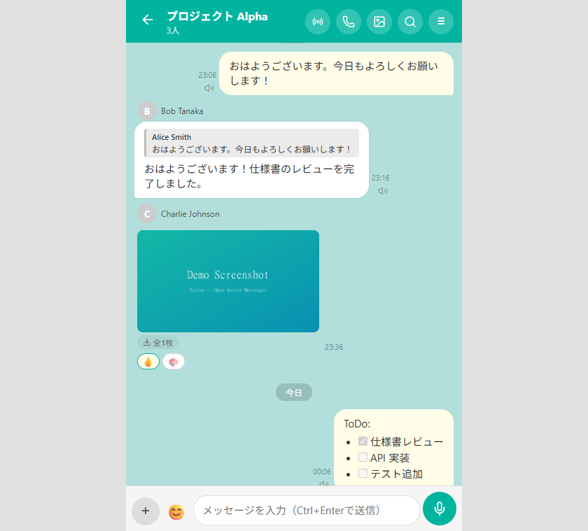
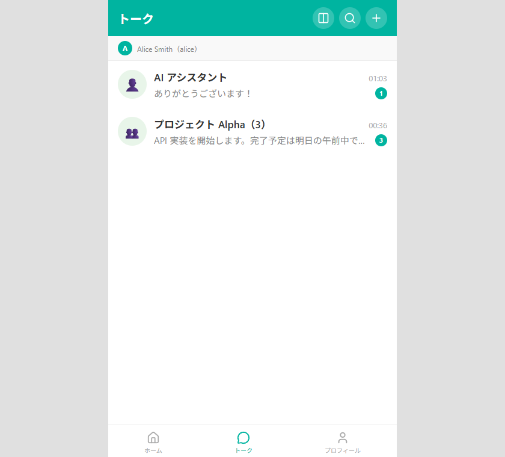
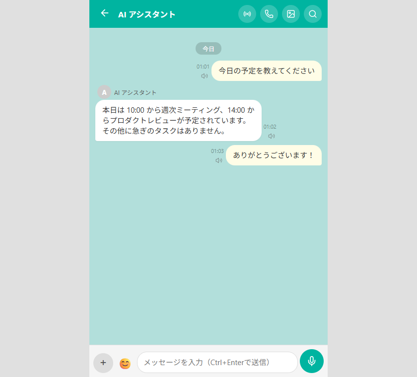

# Tealus

[](https://github.com/gamasenninn/tealus/actions/workflows/test.yml)
[](./LICENSE)

オープンソースの社内メッセンジャー。直感的なチャットUIで、画像・動画はサーバー保存（端末容量を使わない）。

## スクリーンショット

<p align="center">
  
</p>

<p align="center">
  
  &nbsp;&nbsp;
  
</p>

> デモ環境をローカルで立ち上げて触ってみる方法は [demo データ投入スクリプト](./server/scripts/seed-demo.js) 参照。

## 背景

- 既存メッセンジャーの画像・動画が個人スマホの容量を圧迫
- 外部サービスのAPI連携コストが高額
- 誰でも使える直感的なUIが必要

## 機能（Phase 1）

- 1対1チャット / グループチャット
- テキストメッセージ（リアルタイム送受信）
- 画像・動画・ファイルのアップロード（サーバー保存・サムネイル自動生成）
- 既読表示（トーク一覧: 未読数、トーク画面: 既読数）
- リプライ（引用返信）
- Push通知（PWA Service Worker）
- ユーザーIDログイン（JWT認証）
- 直感的な吹き出しUI
- PWA対応（スマホ・PCのブラウザから利用、ホーム画面に追加可能）

## 技術スタック

| レイヤー | 技術 |
|----------|------|
| フロントエンド | React 19 + Vite + PWA (vite-plugin-pwa) |
| 状態管理 | Zustand |
| バックエンド | Node.js + Express + Socket.IO |
| DB | PostgreSQL 16 (RLS有効) |
| キャッシュ | Redis 7 |
| ファイルアップロード | multer + sharp (サムネイル生成) |
| 認証 | JWT + bcrypt |
| Push通知 | web-push (VAPID) |
| コンテナ | Docker Compose |

## セットアップ

### 前提条件

- **Node.js 20+**（`--env-file` を使うため）
- **Docker** + Docker Compose
  - Windows / macOS: **Docker Desktop を起動した状態にしておく**（起動前に `docker-compose` を叩くとデーモンエラー）
  - Linux: Docker daemon が起動していること
- **Git**
- **ffmpeg**（音声通話・TTS のみ必要。[公式サイト](https://ffmpeg.org/download.html) または Chocolatey / Homebrew）

### 1. リポジトリをクローン

```bash
git clone https://github.com/gamasenninn/tealus.git
cd tealus
```

### 2. Docker 起動（PostgreSQL + Redis）

```bash
docker-compose up -d
```

これにより以下が起動します:

| サービス | ポート | 用途 |
|----------|--------|------|
| PostgreSQL | 5432 | 開発用DB |
| PostgreSQL | 5433 | テスト用DB |
| Redis | 6379 | セッション・在席状態管理 |

> **トラブルシューティング**: `error during connect: ... docker daemon is not running` と出たら Docker Desktop が起動していない。起動してから再実行してください。

### 3. サーバーセットアップ

```bash
cd server
npm install
cp .env.example .env
```

#### 環境変数

`.env.example` をコピーして `.env` を作成し、以下を設定してください:

| 変数 | 説明 |
|------|------|
| `JWT_SECRET` | JWT署名キー。下のコマンドで生成。**本番では必須**（未設定で起動失敗） |
| `VAPID_PUBLIC_KEY` | Web Push公開鍵 |
| `VAPID_PRIVATE_KEY` | Web Push秘密鍵 |
| `OPENAI_API_KEY` | 音声文字起こし・AI整形用（任意） |

JWT_SECRET の生成（クロスプラットフォーム）:
```bash
# macOS / Linux (openssl 必須)
openssl rand -hex 32

# Windows PowerShell / クロスプラットフォーム（Node.js で生成）
node -e "console.log(require('crypto').randomBytes(32).toString('hex'))"
```

VAPID鍵の生成:
```bash
npx web-push generate-vapid-keys
```

各変数の詳細は `server/.env.example` 参照。

#### TTS Provider（AI 応答の音声合成）

AI が音声で応答する仕組みは Provider 形式で選択可能です。

| Provider | API Key | 品質 | セットアップ |
|----------|---------|------|-----------|
| `browser` (デフォルト) | 不要 | OS 依存 | **ゼロ設定**、各端末ローカルで合成 |
| `aivis-cloud` | 必要 | 高品質（凛音エル等） | [Aivis Cloud](https://aivis-project.com) で API key 取得 |
| `none` | - | - | TTS 完全無効 |

**デフォルト判定**: `agent-server/.env` の `TTS_PROVIDER` を未設定の場合:
- `AIVIS_API_KEY` あり → `aivis-cloud` 自動選択（既存ユーザー保護）
- `AIVIS_API_KEY` なし → `browser` 自動選択（OSS 採用者向け）

**明示指定する場合は両方の `.env` を揃える**:
```bash
# agent-server/.env
TTS_PROVIDER=browser
# client/.env
VITE_TTS_PROVIDER=browser
```

ブラウザモードでは `SpeechSynthesisUtterance` (Web Speech API) を使うため、各端末の OS 音声で発声します。iOS / macOS は Siri 品質、Windows は SAPI、Android は Google TTS が使われます。

#### DBマイグレーション

```bash
npm run migrate
```

> **初回 Docker 起動時は自動実行される**: `docker-compose.yml` が migrations ディレクトリを PostgreSQL の `/docker-entrypoint-initdb.d` にマウントしているため、**Postgres コンテナの初回起動時にすべての migration が自動適用** されます。したがって初回は `npm run migrate` を省略して直接サーバーを起動しても OK です。
>
> 2 回目以降（新しい migration が追加された時）は `npm run migrate` を手動実行してください。migrations は冪等に設計されているため、再実行しても問題は起きません。

#### サーバー起動

```bash
npm run dev    # 開発（nodemon）
npm start      # 本番
```

サーバーは `http://localhost:3000` で起動します。

### 4. クライアントセットアップ

```bash
cd client
npm install
cp .env.example .env
# VITE_VAPID_PUBLIC_KEY を server の VAPID_PUBLIC_KEY と同じ値に設定
npm run dev
```

クライアントは `http://localhost:5173` で起動します。
Viteのプロキシ設定により、`/api/*` と `/socket.io` はサーバーに自動転送されます。

### 5. 初回ユーザー登録

ブラウザで `http://localhost:5173` を開いても、まだユーザーがいません。
APIで初回ユーザーを登録します:

**macOS / Linux / Git Bash**:
```bash
curl -X POST http://localhost:3000/api/auth/register \
  -H "Content-Type: application/json" \
  -d '{"login_id":"admin","display_name":"管理者","password":"password123"}'
```

**Windows CMD**（1 行 + 内側の " をエスケープ）:
```cmd
curl -X POST http://localhost:3000/api/auth/register -H "Content-Type: application/json" -d "{\"login_id\":\"admin\",\"display_name\":\"管理者\",\"password\":\"password123\"}"
```

**Windows PowerShell**（Invoke-RestMethod のほうが素直）:
```powershell
Invoke-RestMethod -Uri http://localhost:3000/api/auth/register -Method Post -ContentType "application/json" -Body (@{login_id="admin"; display_name="管理者"; password="password123"} | ConvertTo-Json)
```

以降はログイン画面からユーザーIDとパスワードでログインできます。

### 6. 仲間を追加 / デモ環境でフル体験（任意）

管理者ユーザー 1 人だけでは UI が寂しいので、以下のいずれかで複数人のチャットを試せます。

**A. 追加ユーザーを登録**（現在の dev 環境で継続）

上の curl コマンドの `login_id` / `display_name` を変えて叩くだけ。別ブラウザのプライベートウィンドウで別ユーザーとしてログインすれば、DM・グループチャットをすぐ試せます。

**B. デモ環境でフル体験**（alice / bob / charlie / AI アシスタント + サンプルメッセージ入り）

dev 環境を停めずに並行で別 DB / 別ポートに立てます:

```bash
# 1. デモ用 DB 作成（1 回だけ）
docker exec -it tealus_postgres psql -U tealus -d postgres -c "CREATE DATABASE tealus_demo OWNER tealus;"

# 2. デモ DB にマイグレーション + シード投入
cd server
npm run migrate:demo
npm run seed:demo

# 3. デモサーバー起動（別ターミナル、port 3001）
npm run dev:demo

# 4. デモクライアント起動（別ターミナル、port 5174）
cd ../client
npm run dev:demo
```

ブラウザで `http://localhost:5174` → ユーザー ID: `alice` / パスワード: `demo1234` でログイン。
README 冒頭のスクリーンショットと同じ画面がそのまま再現されます。

詳細は [`server/scripts/seed-demo.js`](./server/scripts/seed-demo.js) のヘッダーコメントを参照。

## テスト

### サーバーテスト（Jest）

```bash
cd server

# テスト用DB起動済みであること（docker-compose up -d）
npm test           # 全テスト実行
npm run test:watch # ウォッチモード
```

### クライアントテスト（Vitest）

```bash
cd client
npm test           # 全テスト実行
npm run test:watch # ウォッチモード
```

## ディレクトリ構成

```
tealus/
├── client/                    # React PWA フロントエンド
│   ├── src/
│   │   ├── components/
│   │   │   ├── auth/          # ログイン画面
│   │   │   ├── chat/          # トーク画面（吹き出し・入力）
│   │   │   └── room-list/     # トーク一覧・ルーム作成
│   │   ├── services/          # APIクライアント・Socket.IO
│   │   └── stores/            # Zustand状態管理
│   └── __tests__/
│
├── server/                    # Node.js バックエンド
│   ├── src/
│   │   ├── routes/            # REST APIエンドポイント
│   │   ├── socket/            # Socket.IOハンドラ
│   │   ├── middleware/        # JWT認証・ファイルアップロード
│   │   ├── services/          # Push通知・サムネイル生成
│   │   └── db/                # DB接続・マイグレーション
│   └── __tests__/
│
├── media/                     # アップロードファイル保存先
├── docs/                      # 設計書
│   ├── 01_要件定義.md
│   ├── 02_DB設計.md
│   └── 03_アーキテクチャ設計.md
│
├── docker-compose.yml
└── CLAUDE.md                  # AI開発ガイドライン
```

## API一覧

### 認証

| メソッド | パス | 説明 |
|----------|------|------|
| POST | /api/auth/register | ユーザー登録 |
| POST | /api/auth/login | ログイン（JWT発行） |
| GET | /api/auth/me | 現在ユーザー取得 |
| PUT | /api/auth/profile | プロフィール更新（表示名・ステータスメッセージ） |
| POST | /api/auth/avatar | プロフィール画像アップロード |
| PUT | /api/auth/password | パスワード変更 |

### ユーザー

| メソッド | パス | 説明 |
|----------|------|------|
| GET | /api/users | ユーザー一覧 |
| GET | /api/users/online | オンラインユーザーID一覧 |

### ルーム

| メソッド | パス | 説明 |
|----------|------|------|
| GET | /api/rooms | ルーム一覧（未読数・メンバー数付き） |
| POST | /api/rooms | グループ作成 |
| POST | /api/rooms/direct | 1対1ルーム作成 |
| GET | /api/rooms/:id | ルーム詳細 |
| PUT | /api/rooms/:id | グループ名変更 |
| POST | /api/rooms/:id/icon | グループアイコンアップロード |

### メッセージ

| メソッド | パス | 説明 |
|----------|------|------|
| GET | /api/rooms/:id/messages | メッセージ履歴（ページネーション） |
| POST | /api/rooms/:id/messages | メッセージ送信 |
| DELETE | /api/rooms/:id/messages/:msgId | メッセージ削除（論理削除） |
| POST | /api/rooms/:id/messages/:msgId/reactions | 絵文字リアクション（トグル） |

### メディア・音声

| メソッド | パス | 説明 |
|----------|------|------|
| POST | /api/rooms/:id/media | ファイルアップロード（画像・動画・ファイル） |
| POST | /api/rooms/:id/voice | 音声メッセージアップロード（自動文字起こし） |

### 文字起こし

| メソッド | パス | 説明 |
|----------|------|------|
| PUT | /api/messages/:id/transcription | 文字起こしテキスト編集 |
| GET | /api/messages/:id/transcription/history | 編集履歴取得 |

### メンバー管理

| メソッド | パス | 説明 |
|----------|------|------|
| POST | /api/rooms/:id/members | メンバー追加 |
| DELETE | /api/rooms/:id/members/me | 自分が退会 |
| DELETE | /api/rooms/:id/members/:userId | メンバー除外 |
| PUT | /api/rooms/:id/members/:userId/role | グループ管理者変更 |

### その他

| メソッド | パス | 説明 |
|----------|------|------|
| POST | /api/rooms/:id/read | 既読マーク |
| POST | /api/push/subscribe | Push通知購読登録 |
| DELETE | /api/push/subscribe | Push通知購読解除 |
| GET | /api/health | ヘルスチェック |

### 管理者API

| メソッド | パス | 説明 |
|----------|------|------|
| GET | /api/admin/users | ユーザー一覧（管理者のみ） |
| POST | /api/admin/users | ユーザー作成 |
| PUT | /api/admin/users/:id | ユーザー編集 |
| PATCH | /api/admin/users/:id/status | ユーザー有効化/無効化 |

## Socket.IO イベント

| イベント | 方向 | 説明 |
|----------|------|------|
| room:join | client → server | ルームに参加 |
| room:leave | client → server | ルームから退出 |
| message:send | client → server | メッセージ送信 |
| message:new | server → client | 新着メッセージ通知 |
| message:read | 双方向 | 既読通知 |
| message:deleted | server → client | メッセージ削除通知 |
| message:reaction | server → client | リアクション更新 |
| voice:status | server → client | 文字起こしステータス更新 |
| voice:transcription | server → client | 文字起こし結果 |
| link:preview | server → client | リンクプレビュー結果 |
| typing:start | 双方向 | 入力中通知 |
| typing:stop | 双方向 | 入力停止通知 |
| user:online | server → client | ユーザーオンライン通知 |
| user:offline | server → client | ユーザーオフライン通知 |
| member:added | server → client | メンバー追加通知 |
| member:removed | server → client | メンバー退会/除外通知 |

## 本番デプロイ

### Nginx設定例

```nginx
server {
    listen 80;
    server_name tealus.example.com;

    # React PWA
    location / {
        root /var/tealus/client/dist;
        try_files $uri $uri/ /index.html;
    }

    # REST API
    location /api/ {
        proxy_pass http://localhost:3000;
        proxy_set_header Host $host;
        proxy_set_header X-Real-IP $remote_addr;
    }

    # WebSocket
    location /socket.io/ {
        proxy_pass http://localhost:3000;
        proxy_http_version 1.1;
        proxy_set_header Upgrade $http_upgrade;
        proxy_set_header Connection "upgrade";
    }

    # メディアファイル配信
    location /media/ {
        alias /var/tealus/media/;
        expires 30d;
    }
}
```

### クライアントビルド

```bash
cd client
npm run build
# dist/ ディレクトリが生成される
```

## フェーズ計画

- **Phase 1（完了）**: MVP — チャット・メディア・既読・リプライ・メッセージ削除・音声メッセージ（Whisper文字起こし＋AI整形）・グループ管理・ユーザー管理・コンテキストメニュー・日付区切り・通知音・文字サイズ設定・PWA
- **Phase 2**: メッセージ検索、メンション、アルバム、スタンプ、ピン留め
- **Phase 3**: AI Bot連携（MCP経由）、AIエージェント参加、音声/ビデオ通話（SFU: mediasoup）、LDAP認証

## ライセンス

MIT License - 詳細は [LICENSE](./LICENSE) を参照してください。

Copyright (c) 2026 Satoshi Ono and Tealus Project Contributors
