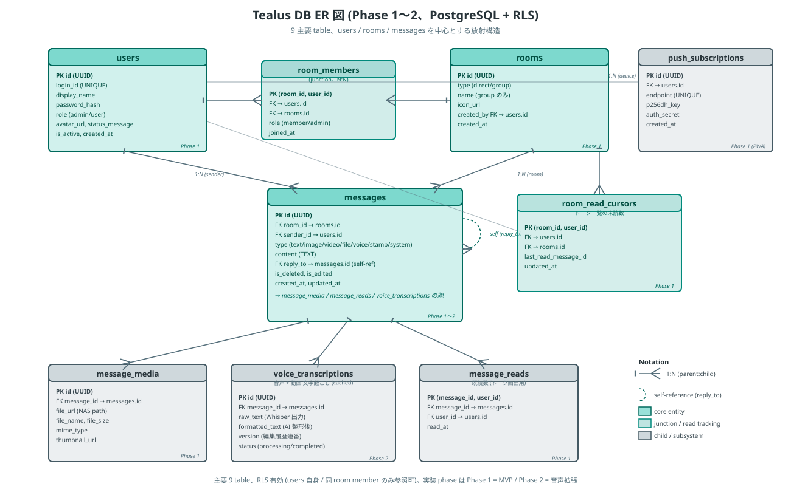

# Tealus - DB設計書

## 概要

PostgreSQL + RLS（Row Level Security）を前提としたDB設計。
Phase 1の全機能をカバーし、Phase 2 以降で追加された音声メッセージ・タグ・リアクション等のテーブルもここに追記する。

## テーブル一覧

> ★★★★ **2026-09-15 の突き合わせ: この表は Phase 1〜2 の 9 本しか載っていない。実スキーマは 23 本。**
> ★ 載っていない 14 本 (導入 issue は各 migration を見ること):
> ```
> message_edits        ★★★ メッセージ編集の版。**意味論は下の節を読むこと** (取り違えると 44% 落ちる)
> message_reactions    リアクション
> message_tags / tags  タグ
> dictionary_terms / dictionary_aliases   辞書 (#327)
> organon_sync_runs    organon pull の記録 (#384)
> link_previews        リンクプレビュー
> agent_contexts       エージェントの文脈
> webhooks             webhook 登録
> portal_links         ポータルのリンク
> stamps / stamp_packs / user_stamp_usage スタンプ
> line_message_links   LINE から届いた便の LINE の ID → Tealus の投稿 (#490、引用返信の引き当て用)
> ```
> ★★ `schema_migrations` は migration 台帳 (#406) で、この表の対象外。
> ★★★ **新しいテーブルを足したら、この表にも足すこと。**
> `__tests__/unit/dbSchemaDoc.test.mts` が migration との差を見張る。

| テーブル名 | 役割 | 導入Phase |
|---|---|---|
| users | ユーザー（ユーザーIDログイン） | 1 |
| rooms | トークルーム（direct/group） | 1 |
| room_members | ルーム参加者 | 1 |
| messages | メッセージ（reply_to付き、type で text/image/video/file/voice/stamp/system） | 1〜2 |
| message_media | 画像・動画・ファイル | 1 |
| room_read_cursors | 未読数管理（トーク一覧用） | 1 |
| message_reads | 既読数管理（トーク画面用） | 1 |
| push_subscriptions | PWA Push通知デバイス管理 | 1 |
| voice_transcriptions | 音声メッセージの文字起こし（version 付き編集履歴） | 2 |

## ER図



> 視覚 overview。下の ASCII art は文字列 grep 可能な軽量 reference。

```
users ──┬──< room_members >──┬── rooms
        │                     │
        ├──< messages >───────┘
        │      │
        │      ├──< message_media
        │      └──< message_reads
        │
        ├──< room_read_cursors >── rooms
        └──< push_subscriptions
```

## テーブル定義

### users（ユーザー）

```sql
CREATE TABLE users (
    id            UUID PRIMARY KEY DEFAULT gen_random_uuid(),
    login_id      VARCHAR(20) UNIQUE NOT NULL,  -- ユーザーID（ログインに使う）
    display_name  VARCHAR(50) NOT NULL,
    avatar_url    TEXT,
    status_message VARCHAR(100),
    password_hash TEXT NOT NULL,
    role          VARCHAR(10) DEFAULT 'user' CHECK (role IN ('admin', 'user')),
    is_active     BOOLEAN DEFAULT true,
    last_seen_at  TIMESTAMPTZ,
    created_at    TIMESTAMPTZ DEFAULT now(),
    updated_at    TIMESTAMPTZ DEFAULT now(),
    notification_sound BOOLEAN NOT NULL DEFAULT true  -- メッセージの通知で音を鳴らす (各自が選ぶ、2026-10-08)
);
```

★ `notification_sound` (2026-10-08): 各自がプロフィールで切り替える (`PUT /api/auth/profile`)。**アカウントごと** (どの端末で切っても全部の端末に効く)。
切ると次の 2 つが鳴らなくなる。**通知そのものは出る** (未読・バッジも変えない)。
- 画面の中の音 (Tealus を開いている間に鳴る `notification.wav`)
- メッセージのプッシュ通知の音 (`sendPushToRoomMembers` が payload に `silent: true` を付け、Service Worker が `showNotification({ silent })` に渡す)。★ iPhone のホーム画面アプリで効くことを確かめた (2026-10-08)。Android は未確認
- ★ 通話の着信は対象にしない (`room_members.push_muted` と同じ。その場で出る必要があるため)
- それまでは端末ごとの保存 (localStorage の `notificationSound`) で、画面の中の音にしか効かなかった。端末に `off` が残っていれば、最初に開いたときにアカウントへ移す

### rooms（トークルーム）

```sql
CREATE TABLE rooms (
    id          UUID PRIMARY KEY DEFAULT gen_random_uuid(),
    type        VARCHAR(10) NOT NULL CHECK (type IN ('direct', 'group')),
    name        VARCHAR(100),          -- グループ名（directはNULL）
    icon_url    TEXT,                   -- グループアイコン
    created_by  UUID REFERENCES users(id),
    created_at  TIMESTAMPTZ DEFAULT now(),
    updated_at  TIMESTAMPTZ DEFAULT now(),
    push_machine_posts BOOLEAN NOT NULL DEFAULT false  -- 機械 (is_bot) の投稿でも通知を鳴らす (#463)
);
```

★ `push_machine_posts` (#463, 2026-09-28): ルームの管理者が選ぶ (`PUT /api/rooms/:id`)。既定は鳴らさない。
人の投稿はこの列に関係なく鳴る。★ 各自の `room_members.push_muted` がこれより優先する (オフにした人には鳴らない)。
連投もまとめずに 1 件ずつ鳴らす (利用者判断)。経路ごとの有無は docs/07。
(列の一覧は抜粋。ほかの列は migrations を正とする)

### room_members（ルーム参加者）

```sql
CREATE TABLE room_members (
    room_id     UUID REFERENCES rooms(id) ON DELETE CASCADE,
    user_id     UUID REFERENCES users(id) ON DELETE CASCADE,
    role        VARCHAR(10) DEFAULT 'member' CHECK (role IN ('admin', 'member')),
    nickname    VARCHAR(50),           -- ルーム内ニックネーム
    joined_at   TIMESTAMPTZ DEFAULT now(),
    push_muted  BOOLEAN NOT NULL DEFAULT false,  -- このルームの通知を鳴らさない (各自が選ぶ、#463)
    PRIMARY KEY (room_id, user_id)
);
```

★ `push_muted` (#463, 2026-09-28): 各自が自分の分だけ切り替える (`PUT /api/rooms/:id/notification`)。
メッセージの通知 (`sendPushToRoomMembers`、#475 まで `sendPushToOfflineMembers`) からその人を除く。★ 画面の中の音 (Tealus を開いている間) も鳴らさない (2026-10-08。それまではプッシュにしか効かず、「切ったのに鳴る」と言われた)。**通話の着信は止めない** (その場で出る必要があるため。LINE もトークの通知オフで着信は止まらない)。
未読数・バッジは変えない (鳴らさないだけで、読んでいないことは変わらない)。

### messages（メッセージ）

```sql
CREATE TABLE messages (
    id          UUID PRIMARY KEY DEFAULT gen_random_uuid(),
    room_id     UUID REFERENCES rooms(id) ON DELETE CASCADE NOT NULL,
    sender_id   UUID REFERENCES users(id) NOT NULL,
    content     TEXT,                  -- テキスト本文（メディア/音声のみの場合NULL可）
    type        VARCHAR(20) DEFAULT 'text' CHECK (type IN ('text', 'image', 'video', 'file', 'voice', 'stamp', 'system')),
    reply_to    UUID REFERENCES messages(id),  -- リプライ先（シンプルな引用）
    is_deleted  BOOLEAN DEFAULT false,
    created_at  TIMESTAMPTZ DEFAULT now(),
    updated_at  TIMESTAMPTZ DEFAULT now()
);

CREATE INDEX idx_messages_room_created ON messages(room_id, created_at DESC);
CREATE INDEX idx_messages_reply_to ON messages(reply_to) WHERE reply_to IS NOT NULL;

-- pg_trgm + GIN index による全文検索高速化（Phase 2 で migration 021 として追加）
-- 3 文字以上の query で 70-80x speedup（2 文字日本語は trigram 最小長制約により効果薄）
CREATE EXTENSION IF NOT EXISTS pg_trgm;
CREATE INDEX idx_messages_content_trgm ON messages USING gin (content gin_trgm_ops);
```

`type` の拡張履歴:
- Phase 1: `text`, `image`, `video`, `file`, `system`
- Phase 2: `voice` 追加 (migration 003)
- Phase 2 後半: `stamp` 追加 (migration 008)

`type = 'system'` の `sender_id` は**本文の主語になる本人** (2026-10-03〜):
- 入退室・管理者の変更は操作した人、ボットの参加は入ったボット、通話の開始は始めた人 (終了は最後に抜けた人。本文に主語は無い)、スタンプの完成・失敗は作った人
- 送り主は部屋のメンバーでなくてよい (退会した本人が「退会しました」の送り主になる)
- ★ 2026-10-03 より前の入退室の分は、部屋の誰か 1 人を借りていた (本番 377 件中 127 件が本文に出てこない人)。
  **過去分は書き換えていない**ので、古い system メッセージの `sender_id` を「誰がやったか」の根拠にしないこと
- system メッセージは編集も削除もできない (部屋の記録)

### message_media（メディアファイル）

```sql
CREATE TABLE message_media (
    id              UUID PRIMARY KEY DEFAULT gen_random_uuid(),
    message_id      UUID REFERENCES messages(id) ON DELETE CASCADE NOT NULL,
    file_path       TEXT NOT NULL,         -- サーバー上の保存パス
    file_name       TEXT NOT NULL,         -- 元のファイル名
    mime_type       VARCHAR(100) NOT NULL,
    file_size       BIGINT NOT NULL,       -- bytes
    width           INT,                   -- 画像/動画の幅
    height          INT,                   -- 画像/動画の高さ
    thumbnail_path  TEXT,                  -- サムネイル（画像・動画）
    created_at      TIMESTAMPTZ DEFAULT now()
);
```

```sql
-- #549 添付はいつもメッセージから引く (WHERE message_id = ANY(...))。無いと毎回全行を読む (2026-10-10 に 2.5 万行 × 13.7 万回)
CREATE INDEX idx_message_media_message ON message_media(message_id);
```

### room_read_cursors（未読数管理 - トーク一覧用）

```sql
CREATE TABLE room_read_cursors (
    room_id              UUID REFERENCES rooms(id) ON DELETE CASCADE,
    user_id              UUID REFERENCES users(id) ON DELETE CASCADE,
    last_read_message_id UUID REFERENCES messages(id),
    last_read_at         TIMESTAMPTZ DEFAULT now(),
    PRIMARY KEY (room_id, user_id)
);
```

### message_reads（既読数管理 - トーク画面用）

```sql
CREATE TABLE message_reads (
    message_id  UUID REFERENCES messages(id) ON DELETE CASCADE,
    user_id     UUID REFERENCES users(id) ON DELETE CASCADE,
    read_at     TIMESTAMPTZ DEFAULT now(),
    PRIMARY KEY (message_id, user_id)
);

CREATE INDEX idx_message_reads_message ON message_reads(message_id);
```

### push_subscriptions（Push通知デバイス管理）

```sql
CREATE TABLE push_subscriptions (
    id          UUID PRIMARY KEY DEFAULT gen_random_uuid(),
    user_id     UUID REFERENCES users(id) ON DELETE CASCADE NOT NULL,
    endpoint    TEXT NOT NULL,              -- PWA push endpoint URL
    p256dh_key  TEXT NOT NULL,              -- 暗号化キー
    auth_key    TEXT NOT NULL,              -- 認証キー
    device_name VARCHAR(100),              -- 「iPhoneのSafari」等
    is_active   BOOLEAN DEFAULT true,
    created_at  TIMESTAMPTZ DEFAULT now(),
    updated_at  TIMESTAMPTZ DEFAULT now(),
    UNIQUE(user_id, endpoint)              -- 同デバイス重複防止
);
```

### voice_transcriptions（音声メッセージの文字起こし）

```sql
CREATE TABLE voice_transcriptions (
    id              UUID PRIMARY KEY DEFAULT gen_random_uuid(),
    message_id      UUID REFERENCES messages(id) ON DELETE CASCADE NOT NULL,
    version         INT NOT NULL DEFAULT 1,    -- 編集ごとに +1
    raw_text        TEXT,                       -- Whisper 出力 (元の転写)
    formatted_text  TEXT,                       -- AI 整形後 (gpt-4o-mini)
    status          VARCHAR(20) DEFAULT 'pending'
                     CHECK (status IN ('pending','transcribing','formatting','done','error')),
    edited_by       UUID REFERENCES users(id),  -- NULL: AI 生成 / NOT NULL: 人間編集
    created_at      TIMESTAMPTZ DEFAULT now()
);

CREATE INDEX idx_voice_transcriptions_message ON voice_transcriptions(message_id, version DESC);

-- pg_trgm + GIN index による文字起こし全文検索（migration 021）
CREATE INDEX idx_voice_trans_formatted_trgm ON voice_transcriptions USING gin (formatted_text gin_trgm_ops);
CREATE INDEX idx_voice_trans_raw_trgm       ON voice_transcriptions USING gin (raw_text gin_trgm_ops);
```

設計上の重要な性質:

- **編集は INSERT のみ** (UPDATE しない)。同じ `message_id` に対し `version` を +1 した行を新規追加。version は immutable な履歴として積み上がる
- **`edited_by IS NULL`** = AI 生成版 (Whisper → AI 整形のパイプライン出力)
- **`edited_by IS NOT NULL`** = 人間が UI から訂正した版
- **検索は最新 version + formatted_text OR raw_text の OR**: ノイズ削除時は両方クリアする必要あり
- 文字起こし内容のカスタマイズは **設定ファイル `server/config/transcription_guideline.json`** 経由 (詳細はアーキテクチャ設計書参照)

`status` 遷移: `pending` → `transcribing` → `formatting` → `done` (または `error`)

### ★★★★ message_edits（メッセージ編集の版）— 取り違えると 44% 落ちる

```
id / message_id / version / content / edited_by / created_at
```

★★★★★ **この表が持つのは「過去の版」だけ。最新版は `messages.content` にある。**

```
★ 1 回編集したメッセージ  message_edits に 1 行 (= 編集**前**の内容) + messages.content (= 編集後)
★ 2 回編集              message_edits に 2 行 + messages.content
```

★★ **版どうしを連続で組むだけだと、最後の遷移 (= 人が受け入れた訂正) が丸ごと落ちる。**
実測 (2026-09-15、通話履歴 / 14 日):

```
編集のあったメッセージ 310 件 / message_edits 702 行
★ 版の間だけ組んだ対        392 組
★★★★ 落ちていた最後の遷移   310 組 (44%)
★★ うち 1 回だけ編集された 127 件は **対が 0 件** = 丸ごと不可視
```
→ ★ 版を並べるときは **最後の版 → `messages.content`** を必ず足す
  (`server/scripts/correctionLedger.mts` の `pairVersions`)。

### line_message_links（LINE の ID → Tealus の投稿）— #490

```
line_message_id (PK) / message_id → messages.id (ON DELETE CASCADE) / room_id / created_at
```

★ LINE の引用返信は **引用元の ID (`quotedMessageId`) だけ**を送ってくる (本文は来ない)。
引き当てるには、届いた便の LINE の ID を Tealus 側に残しておくしかない。

- LINE から投稿した便は**種類を問わず全部**記録する (引用されるのは文字とは限らない)。画像のまとめ投稿は束の各 ID を同じ 1 投稿へ
- 引き当ては **同じ部屋**に限る (別の部屋の投稿を `reply_to` にしない)
- ★ 記録を始める前 (2026-10-04 より前) の投稿は引き当てられない。そのときは本文に「引用元はこちらに届いていない」と添える
- 記録の失敗は投稿を止めない (warn だけ)

### ★★ voice_transcriptions の `version` — 行を数えると発話を二重に数える

★ 1 メッセージに複数版が入る (再文字起こし / 整形のやり直し)。実測 (2026-09-15、30 日):

```
1 版 563 メッセージ / ★ 2 版 692 / 3 版 11 / 4 版 1
→ ★★ 行 1,984 に対して 実際のメッセージは 1,267 (**56% 水増し**)
```
★★★ **`voice_transcriptions` をそのまま数えると発話数にならない。**
最新版だけを見るなら `DISTINCT ON (message_id) ... ORDER BY message_id, version DESC`。

## 設計方針

| 設計判断 | 理由 |
|----------|------|
| 既読は2層構造（ルーム単位 + メッセージ単位） | LINEの挙動を再現。一覧で「未読5」、トークで「既読3」を両立 |
| リプライはmessages.reply_toで自己参照 | Slackのようなスレッドではなく、LINEの「このメッセージに返信」。別テーブル不要 |
| メディアは別テーブル（message_media） | 1メッセージに複数ファイル添付を想定。将来のアルバム機能にも対応しやすい |
| rooms.typeでdirect/group区別 | 1対1もグループも同じ仕組みで扱える |
| UUIDを主キー | 分散環境でID衝突なし、URLに露出してもシーケンシャルIDより安全 |
| 削除は論理削除（is_deleted） | 「メッセージが削除されました」をLINEと同様に表示するため |
| 文字起こしは version 付き履歴（INSERT のみ、UPDATE しない） | 編集前後を保持し AI 訂正・人間訂正を区別できる。`edited_by` で AI/人間を判別 |
| `edited_by IS NULL` を AI 版マーカーに | 編集履歴の AI 版 vs 人間訂正版を区別する単純な signal、自動学習 (#206) の基礎データに |
| pg_trgm + GIN index で全文検索 | 既存 ILIKE クエリのまま 70-80x 高速化 (3 文字以上 query)。日本語 2 文字は trigram 最小長で効果薄、必要なら pgroonga 検討 |

## RLS（Row Level Security）方針

```sql
-- メッセージは自分が参加しているルームのものだけ見える
ALTER TABLE messages ENABLE ROW LEVEL SECURITY;

CREATE POLICY messages_select ON messages
    FOR SELECT USING (
        room_id IN (
            SELECT room_id FROM room_members
            WHERE user_id = current_setting('app.current_user_id')::UUID
        )
    );
```

## 既読の動作仕様

### トーク一覧の「未読数」表示

```sql
-- 未読メッセージ数を取得
SELECT COUNT(*) FROM messages m
WHERE m.room_id = :room_id
  AND m.created_at > (
      SELECT last_read_at FROM room_read_cursors
      WHERE room_id = :room_id AND user_id = :user_id
  );
```

### トーク画面の「既読N」表示

```sql
-- あるメッセージを読んだ人数を取得
SELECT COUNT(*) FROM message_reads
WHERE message_id = :message_id;
```

### 書き込みタイミング

1. ユーザーがトーク画面を開く
2. 画面に表示されたメッセージをまとめて message_reads に INSERT
3. room_read_cursors の last_read_message_id / last_read_at を更新
4. WebSocketで「既読イベント」を他ユーザーにブロードキャスト
5. 相手画面の「既読N」がリアルタイム更新
