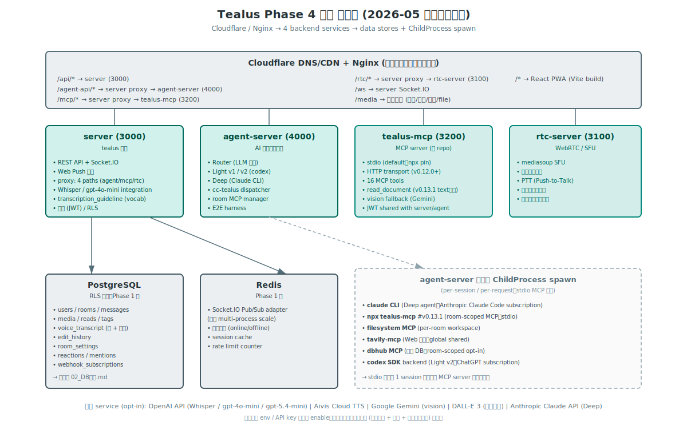
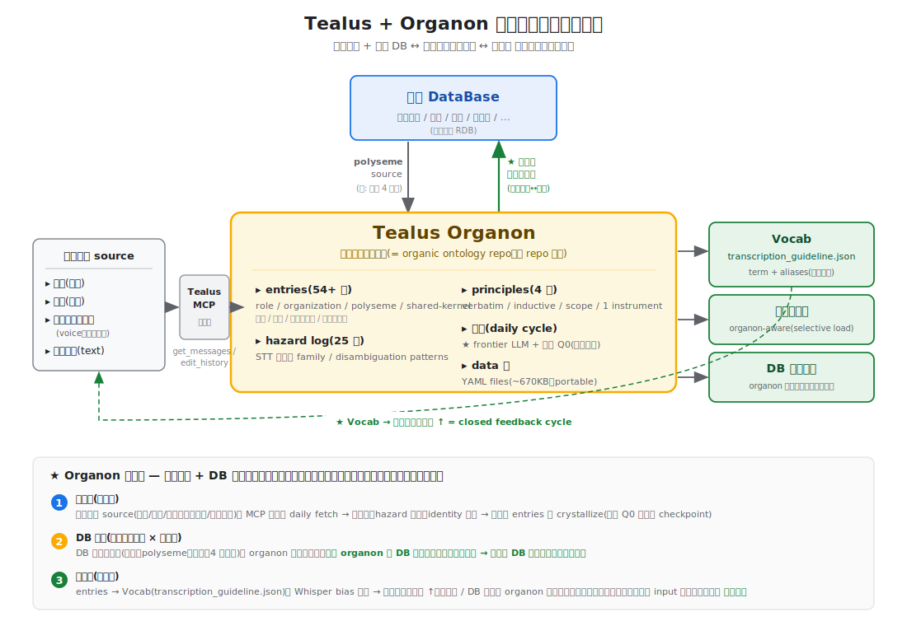

# Tealus - アーキテクチャ設計書

## システム構成図

```
                          ┌─────────────────────────────────┐
                          │        Cloudflare DNS/CDN       │
                          │    (外部アクセス・SSL終端)       │
                          └──────────────┬──────────────────┘
                                         │
                          ┌──────────────┴──────────────────┐
                          │          Nginx (リバプロ)        │
                          │  - /api/*  → Node.js REST       │
                          │  - /ws     → Node.js WebSocket  │
                          │  - /media  → 静的ファイル配信    │
                          │  - /*      → React PWA (静的)   │
                          └──────┬──────────────┬───────────┘
                                 │              │
                    ┌────────────┴──┐    ┌──────┴───────────┐
                    │   Node.js     │    │   静的ファイル    │
                    │   サーバー    │    │   ストレージ      │
                    │               │    │                   │
                    │ ┌───────────┐ │    │ /media/           │
                    │ │ Express   │ │    │   images/         │
                    │ │ REST API  │ │    │   videos/         │
                    │ ├───────────┤ │    │   files/          │
                    │ │ Socket.IO │ │    │   thumbnails/     │
                    │ │ WebSocket │ │    └───────────────────┘
                    │ ├───────────┤ │
                    │ │ Web Push  │ │
                    │ │ Service   │ │
                    │ └─────┬─────┘ │
                    └───────┼───────┘
                            │
               ┌────────────┼────────────────┐
               │            │                │
        ┌──────┴──────┐ ┌──┴─────────┐ ┌────┴──────────┐
        │ PostgreSQL  │ │   Redis    │ │ Python AI     │
        │             │ │            │ │ モジュール    │
        │ - users     │ │ - セッション│ │ (将来Phase3) │
        │ - rooms     │ │ - 在席状態 │ │               │
        │ - messages  │ │ - Pub/Sub  │ │ - MCP経由     │
        │ - media     │ │   (WS配信) │ │ - DB参照      │
        │ - reads     │ │            │ │ - 自動応答    │
        └─────────────┘ └────────────┘ └───────────────┘
```

> 上図は Phase 1 baseline (Phase 3 で Python AI モジュール想定箇所が後に Node.js の agent-server + tealus-mcp に分離決定)。Phase 4 中盤 (2026-05 時点) の実態は以下:

### Phase 4 中盤 構成図 (2026-05、実装済)



> 視覚 overview。下の ASCII art は文字列 grep 可能な詳細 reference。

```
                          [Cloudflare DNS/CDN + Nginx (前段)]
                                         │
              ┌──────────────────────────┼──────────────────────────┐
              │ /api/*       → server (3000)                         │
              │ /agent-api/* → server proxy → agent-server (4000)   │
              │ /mcp/*       → server proxy → tealus-mcp (3200)     │
              │ /rtc/*       → server proxy → rtc-server (3100)     │
              │ /ws          → server Socket.IO                      │
              │ /media       → 静的配信                              │
              │ /*           → React PWA                             │
              └──────────────────────────────────────────────────────┘
                                         │
   ┌────────────────────────┬─────────────┴─────────────┬──────────────────┐
   │                        │                           │                  │
┌──┴────────────┐  ┌────────┴──────────┐  ┌─────────────┴────────┐  ┌──────┴────────────┐
│ server (3000) │  │ agent-server      │  │ tealus-mcp (3200)    │  │ rtc-server (3100) │
│ REST + WS +   │  │ (4000)            │  │ - stdio (default)    │  │ - mediasoup SFU   │
│ Web Push +    │  │ - Router 振分     │  │ - HTTP (#264、       │  │ - PTT / 通話 /    │
│ proxy 4 paths │  │ - Light v1/v2/    │  │   v0.12.0+)          │  │   トランシーバー  │
│               │  │   Deep            │  │ - 15 MCP tools       │  │                   │
│               │  │ - cc-tealus       │  │ - read_document      │  │                   │
│               │  │   dispatcher      │  │   (vision fallback)  │  │                   │
│               │  │ - room MCP mgr    │  │ - JWT shared with    │  │                   │
│               │  │ - session mgr     │  │   server / agent-svr │  │                   │
│               │  │ - E2E harness     │  │                      │  │                   │
└───┬───────────┘  └──┬────────────────┘  └──────────────────────┘  └───────────────────┘
    │                 │
    │            ┌────┴───────────────────────┐
    │            │ ChildProcess spawn:        │
    │            │ - claude CLI (Deep)        │
    │            │ - npx tealus-mcp (room MCP)│
    │            │ - filesystem MCP / tavily  │
    │            └────────────────────────────┘
    │
┌───┴──────────┐  ┌──────────────┐
│ PostgreSQL   │  │ Redis        │
│ - users      │  │ - WS Pub/Sub │
│ - rooms      │  │ - 在席状態   │
│ - messages   │  │ - session    │
│ - media      │  │   cache      │
│ - reads      │  └──────────────┘
│ - tags       │
│ - voice_     │
│   transcript │
└──────────────┘
```

### Organon 接続層 拡大図 (= 2026-05 時点、utilization 層 application 第 1 family)



> 上図は Phase 4 中盤構成のうち **Organon 接続層** に focus した拡大図。業務 DB ↔ Organon ↔ 業務会話 source ↔ 利用層 (Vocab / 議事録生成 / DB 検索結果) の循環を視覚化。
>
> ★ 「Vocab → 文字起こし精度↑」の closed feedback cycle が、organon が観測装置だけでなく整流装置として機能する evidence。Organon の概念 4 層 model は `04_オーガニックオントロジー構造.md` を参照。

外部 service (実装時 opt-in):

- **OpenAI API**: Whisper (転写) + gpt-4o-mini (整形 / Light v1 / Router LLM) + gpt-5.4-mini (Light v1 model)
- **codex backend**: Light v2 (`@openai/codex-sdk` v0.128.0、API key or ChatGPT subscription)
- **Anthropic Claude CLI** (Deep agent、`claude` CLI、[Claude MAX](https://www.anthropic.com/max) 契約者の opt-in)
- **Google Gemini API** (read_document の scan PDF vision fallback、opt-in)
- **Aivis Cloud TTS** (AI 応答音声の高品質読み上げ、opt-in)
- **DALL-E 3** (generate_and_send_image MCP tool、opt-in)

## 各コンポーネントの役割

| コンポーネント | 役割 |
|---|---|
| Cloudflare | DNS、SSL終端、DDoS防御、外部からのアクセス |
| Nginx | リバースプロキシ、パスベースルーティング、メディア配信 |
| Node.js (Express) | REST API（認証・CRUD）、Socket.IO（リアルタイム）、Web Push送信 |
| PostgreSQL | 全データ永続化、RLSによるアクセス制御 |
| Redis | WebSocket Pub/Sub（将来スケール用）、在席状態管理、セッションキャッシュ |
| 静的ストレージ | アップロード画像・動画・ファイル・サムネイル |
| **OpenAI API** (Phase 2 以降) | Whisper API で音声 → raw_text 転写、gpt-4o-mini で raw_text → formatted_text 整形 |
| Python AIモジュール | Phase 3で追加（実装は agent-server / tealus-mcp に分離）。MCP経由で自動応答・DB参照 |

## Redisの採用理由（Phase 1から導入）

- 在席状態（オンライン/オフライン）をメモリで高速管理
- Socket.IOのPub/Sub adapter — 将来Node.jsを複数プロセスにスケール時のブローカー
- 50人規模ではメモリ使用は微々たるもの

## データフロー

### メッセージ送信フロー

```
1. [React] ユーザーがメッセージ入力・送信
2. [Socket.IO] "message:send" イベントをサーバーに送信
3. [Node.js] メッセージをPostgreSQLに保存
4. [Node.js] 同じルームの接続中ユーザーにSocket.IOでブロードキャスト
5. [Node.js] 未接続ユーザーにはWeb Push通知を送信
6. [React] 受信側の画面にリアルタイムで吹き出し表示
```

### 既読更新フロー

```
1. [React] ユーザーがトーク画面を開く/スクロールする
2. [Socket.IO] "message:read" イベント（表示されたメッセージIDリスト）を送信
3. [Node.js] message_reads にINSERT、room_read_cursors を更新
4. [Node.js] 送信者にSocket.IOで既読イベントをブロードキャスト
5. [React] 送信者画面の「既読N」がリアルタイム更新
```

### ファイルアップロードフロー

```
1. [React] ユーザーが画像/動画/ファイルを選択
2. [REST API] POST /api/media にmultipartでアップロード
3. [Node.js] multerでファイル保存、sharpでサムネイル生成
4. [Node.js] message + message_media をDBに保存
5. [Socket.IO] ルーム内にメディアメッセージをブロードキャスト
6. [React] 受信側でサムネイル表示、タップで原寸表示
```

### 音声メッセージ転写フロー（Phase 2 以降）

```
1. [React] 録音ボタン → 音声を MediaRecorder で取得 → POST /api/rooms/:id/voice
2. [Node.js] message (type='voice') 作成、voice_transcriptions に pending 行 INSERT
3. [Node.js] 非同期で transcribeVoiceMessage() を起動 (応答は即返す)
4. [Node.js → OpenAI Whisper] raw_text を取得
   - status: pending → transcribing → raw_text 保存
5. [Node.js → OpenAI gpt-4o-mini] raw_text を AI 整形 → formatted_text
   - status: formatting → done
6. [Socket.IO] voice:transcription イベントでルームに配信
7. [React] VoiceBubble が formatted_text 表示、長押しで raw_text 切替可能
```

転写パイプラインのカスタマイズ (Step 14 で導入):

```
[server/config/transcription_guideline.json] (gitignored、組織固有)
  ├── whisper_context: ドメイン文脈の散文 (例: 業務無線の音声記録)
  ├── vocabulary: [{ term, category, aliases }] — 固有名詞 + 表記ブレ
  └── guidelines: [string] — TV ノイズ除去・連鎖訂正等のルール

注入経路:
  Whisper 呼出 ← whisper_context のみ (224 token、style/spelling bias)
  AI 整形 ← vocabulary + guidelines を SYSTEM_PROMPT に append
```

**重要設計判断**: vocabulary は **AI 整形のみ**で使用。Whisper の `prompt` parameter
に直接 vocabulary を渡すと隣接音が歪む副作用があるため避ける（OpenAI cookbook 確認済）。
固有名詞の正規化は文脈判断ができる AI 整形段階に集約する。

### 音声文字起こしの編集フロー

```
1. [React] VoiceEditModal で formatted_text を編集
2. [REST API] PUT /api/messages/:id/transcription
3. [Node.js] 同 message_id の最新 version + 1 を INSERT (UPDATE しない、履歴保持)
   - edited_by = 編集ユーザーの UUID
   - raw_text は最新 version からコピー継承
4. [Socket.IO] voice:transcription イベントで配信
5. 副次効果: 編集履歴 (AI 版 ↔ 人間訂正版) は alias 自動学習 (#206) のラベルデータになる
```

## ディレクトリ構成

```
tealus/
├── docs/                            # 設計書
│
├── client/                          # React PWA フロントエンド
│   ├── public/
│   │   ├── manifest.json            # PWA マニフェスト
│   │   ├── sw.js                    # Service Worker (Push通知)
│   │   └── icons/                   # PWAアイコン
│   ├── src/
│   │   ├── components/
│   │   │   ├── auth/                # ログイン画面
│   │   │   ├── chat/                # トーク画面（吹き出し・入力欄）
│   │   │   ├── room-list/           # トーク一覧（未読バッジ）
│   │   │   ├── media/               # 画像ビューア・アップロード
│   │   │   ├── admin/               # 管理者ダッシュボード（/admin）
│   │   │   └── common/              # 共通UI部品
│   │   ├── hooks/                   # カスタムフック
│   │   │   ├── useSocket.js         # WebSocket接続管理
│   │   │   ├── useAuth.js           # 認証状態
│   │   │   └── useMessages.js       # メッセージ取得・送信
│   │   ├── services/
│   │   │   ├── api.js               # REST APIクライアント
│   │   │   ├── socket.js            # Socket.IO クライアント
│   │   │   └── push.js              # Push通知登録
│   │   ├── stores/                  # 状態管理 (Zustand)
│   │   ├── utils/
│   │   ├── App.jsx
│   │   └── main.jsx
│   ├── package.json
│   └── vite.config.js               # Vite (ビルドツール)
│
├── server/                          # Node.js バックエンド
│   ├── src/
│   │   ├── routes/                  # REST APIルート
│   │   │   ├── auth.js              # ログイン・JWT発行
│   │   │   ├── users.js             # ユーザー情報
│   │   │   ├── rooms.js             # ルーム作成・一覧
│   │   │   ├── messages.js          # メッセージCRUD
│   │   │   ├── media.js             # ファイルアップロード
│   │   │   └── admin.js             # 管理者API（ユーザー管理）
│   │   ├── socket/                  # WebSocket ハンドラ
│   │   │   ├── index.js             # Socket.IO 初期化
│   │   │   ├── chat.js              # メッセージ送受信イベント
│   │   │   ├── presence.js          # 在席状態管理
│   │   │   └── read.js              # 既読イベント
│   │   ├── middleware/
│   │   │   ├── auth.js              # JWT検証
│   │   │   └── upload.js            # ファイルアップロード(multer)
│   │   ├── services/
│   │   │   ├── push.js              # Web Push送信ロジック
│   │   │   └── thumbnail.js         # サムネイル生成(sharp)
│   │   ├── db/
│   │   │   ├── pool.js              # PostgreSQL接続プール
│   │   │   ├── migrations/          # マイグレーションSQL
│   │   │   └── queries/             # クエリ集約
│   │   ├── utils/
│   │   └── app.js                   # Express + Socket.IO 起動
│   ├── package.json
│   └── .env                         # 環境変数（DB接続等）
│
├── media/                           # アップロードファイル保存先
│   ├── images/
│   ├── videos/
│   ├── files/
│   └── thumbnails/
│
├── nginx/
│   └── tealus.conf                   # Nginx設定
│
└── docker-compose.yml               # PostgreSQL, Redis, Node.js
```

## Nginx設定方針

```
/api/*    → http://localhost:3000  (Node.js REST API)
/ws       → http://localhost:3000  (Socket.IO WebSocket, upgrade対応)
/media/*  → /var/tealus/media/  (静的ファイル直接配信)
/*        → /var/tealus/client/ (React PWAビルド成果物)
```

## Phase 4 拡張 (実装済、2026-05 時点)

Phase 1-3 の baseline 上に、以下が **実装済 + 採用者保護 default 設計** で乗っています。

### 3-tier agent + Router (Light v1 / Light v2 / Deep)

`agent-server/src/router/index.js` で **rules-based 振分 + LLM 振分** の 2 段 Router を採用:

| tier | prefix | 実装 | 用途 |
|---|---|---|---|
| **Router 直接応答** | (rules で挨拶 / 短文 等) | `router/index.js` | LLM 呼ばずに直接応答、cost 0 |
| **Light v1** | `/light` (default) | `agents/light.js` (`@openai/agents` SDK) | 単純会話 / 単 room 要約 (cost 効率、~$0.001/msg) |
| **Light v2** | `/light2` | `agents/lightV2.js` (`@openai/codex-sdk` v0.128.0) | cross-room 探索 / 多角 tool 操作 (完結率高い、~2-4x cost) ([#258](https://github.com/gamasenninn/tealus/issues/258)) |
| **Deep** | `/deep` (or DEEP_KEYWORDS) | `agents/deep.js` (`claude` CLI を child process spawn) | 長時間タスク / コード生成 / Web 検索、user `Cancel` button で中断可 ([#250-#252](https://github.com/gamasenninn/tealus/issues/250)) |

Light v2 は `LIGHTV2_AUTH=subscription` で API key 不要 (ChatGPT Plus / Pro / Team 持ち、`codex login` で `~/.codex/auth.json` 経由)。

### D4 哲学: Tealus = context 空間、agent は MCP で自分で読みに行く

旧 `TealusSession` (前 N 件 message を session 経由で agent に prepend) を削除 (#230、5/4)。現在は **agent が `get_messages` / `search_messages` / `list_tags` MCP tool で自律的に Tealus を読みに行く** 設計。session prepend と MCP fetch の二重 fetch を解消、Light も Deep も統一 mental model。

### tealus-mcp (stdio + HTTP 2 transport)

`tealus-mcp` (別 repo `gamasenninn/tealus-mcp`、v0.12.x) は **MCP server** として Tealus Bot API を公開。15 tools (送受信、検索、tag、room 管理、document parse、image gen 等)。

- **stdio transport** (default、v0.1.0+): Claude Code / Cursor が child process として spawn、`npx -y github:gamasenninn/tealus-mcp` でゼロ設定起動
- **HTTP transport** (opt-in、v0.12.0+、[#264](https://github.com/gamasenninn/tealus/issues/264)): tealus 本体 server (3000) の `/mcp/*` proxy 経由でリモートからも tools を呼べる。**stateful session 管理** (Mcp-Session-Id header)、JWT 共有認証 (tealus / agent-server と同一 `JWT_SECRET`)
- **room 単位 MCP** (`agent-server/src/mcp/roomMcpManager.js`): filesystem MCP は room workspace で自動生成、room 固有 `mcp_config.json` で MCP server 追加可能、global は agent-server 全体共有

### cc-tealus bridge (Claude Code との双方向連携、[#213](https://github.com/gamasenninn/tealus/issues/213))

Tealus 上での `@cc-{project}` mention を agent-server が file beacon (`~/.tealus/cc-queue/{project}.jsonl`) に追記、Claude Code session が **Monitor 経由で sub-second wake-up** する仕組み。

- `cc-aliases.json` 設定ファイル ([#263](https://github.com/gamasenninn/tealus/issues/263)、5/8): `@Claude` 等の alias を **code 変更不要で登録可能**
- mention picker に **cc-proj 仮想 user** 表示 ([#253](https://github.com/gamasenninn/tealus/issues/253)): self-bootstrapping、最初の `@cc-x` で project が出現
- Phase B 拡張 ([#214](https://github.com/gamasenninn/tealus/issues/214)): cross-machine 構成は #264 HTTP transport で構造解、SSE event broker は Phase 2 議論先行 ([#270](https://github.com/gamasenninn/tealus/issues/270))

### E2E verification harness (`agent-server/tools/e2e/`、[#262](https://github.com/gamasenninn/tealus/issues/262))

「CI gate ではなく **調整 phase の verification run**」として設計:

- 6 scenarios (cross-room tag整理 / mention strip / PDF scan / image gen / greeting / deep keyword)
- 判定 layer: 決定論層 (tool chain shape、log line) → fail / 観察層 (token、latency、**LLM-as-judge** Phase 2.b) → warn / 人 review 層 (manual_check)
- test bot user + test room で本番 DB 隔離、CLI が Tealus API 経由で test room に投下

### Deep agent cancel + timeout の構造保護 (Windows process tree race fix)

`agent-server/src/agents/deepRegistry.js` の `register` / `cancel` / **`sweepByWorkspacePath`** で:

- cancel ([#250-#252](https://github.com/gamasenninn/tealus/issues/250)): user `Cancel` button で claude CLI process を kill、Windows の cmd.exe → claude.cmd → claude.exe tree で race により orphan 化する claude.exe を **CommandLine LIKE 一致 sweep で確実に kill**
- timeout (5/11 fix、[commit 918efcd](https://github.com/gamasenninn/tealus/commit/918efcd)): cancel path 同型の sweep を **timeout path にも適用** + **10s safety net** で `processDeep` Promise の close 一本足依存を解消、`enqueueForRoom` queue dead lock を構造的に防止

### dispatcher と room queue (`agent-server/src/webhook/dispatcher.js`)

- `roomQueues = new Map<roomId, Promise>`: room ごとに `enqueueForRoom` で **strict order serialize** (前 task の output 配信 → 次 task 開始)
- 副作用: 1 task の Promise が pending なら queue 全死する潜在脆弱性 → `enqueueForRoom` 全体の outer timeout は [#270](https://github.com/gamasenninn/tealus/issues/270) で議論先行

### multi-Claude session 分業 (Dev / Support / ドキュメント班)

Tealus 自体を substrate として **複数の Claude Code session が並走** する運用 pattern:

- **Dev session** (本体班): code commit / issue / 本体 docs
- **Support session** (listen-tealus skill): `~/.tealus/cc-queue/tealus.jsonl` を tail で監視、`@cc-tealus` mention 時 reactive 応答 (auto_level=L1/L2/L3)
- **ドキュメント班** (別 session): tealus-docs (公開 MkDocs) repo の drift fix

AI 班連絡 room を coordination channel として明示的 handoff、lane 分離で衝突ゼロ。

## Day 15 (= 2026-05-31) 進展 — Codex Deep agent + organon polyseme inject pipeline 完成

★ Day 14 で確立した「足場 = skill / 判断 = 人間」境界設計の延長で、Day 15 に 2 件の構造的 progression が完成。本 section は agent-server architecture 上の Day 15 反映 reference として記録。

### Codex Deep agent ([#276](https://github.com/gamasenninn/tealus/issues/276))

既存 Deep agent (= `agent-server/src/agents/deep.js`、`claude -p` spawn) と並列で、`agent-server/src/agents/deepCodex.js` を新規追加 (= `codex exec` spawn、Light v2 (#258) で確立した Codex SDK / subscription auth pattern を CLI mode で再現)。

- env `DEEP_AGENT_PROVIDER=claude|codex` (default=claude、既存維持) で `dispatcher.js` の `case 'deep'` で switch
- env `DEEP_CODEX_AUTH=subscription|api-key` (default=subscription) で `~/.codex/auth.json` 経由 ChatGPT subscription 認証 (= API cost 0、★ Deep mode の 12-50k tokens × call 課金爆発 risk 回避 default)
- `CODEX_HOME` 動的切替 = workspace 配下 `.codex_home/` に `auth.json` copy + `config.toml` 動的生成、room-specific MCP config 完全制御
- `AGENTS.md` (= Codex 自動 read project context file) = `CLAUDE.md` literal copy で起動
- JSONL event stream parse + 「最後の非空 agent_message」採用 (= Light v2 line 246-260 pattern 同型)
- 流用: `deepRegistry.js` (= cancel / sweep) + `botApi` (= status / message push) + Light v2 `buildLightV2McpConfig`
- TDD test 34 件追加 (= `config-codex-detection.test.js` 7 + `deepCodex.test.js` 27)、全 305 → 317 Green
- 5/31 17:35-17:36 dogfood 第 1 例 success (= subscription auth confirmed、1m38s / 1060 chars 応答)

→ ★ Claude MAX 契約必須を超えた選択肢拡大、Anthropic / OpenAI 両 provider Deep mode 同等運用可能化。

### organon polyseme inject pipeline ([#276 follow-up](https://github.com/gamasenninn/tealus/issues/276))

agent (= Light v1 / v2 / Deep / Deep Codex) の system prompt build path に organon polyseme.sql_mapping を per-request inject する共通 utility `agent-server/src/lib/organonContext.js` を追加。

```
[構築層] tealus-organon の /db-organon-build skill (= user voice 主導即実装、5/31 Day 15 構築層 cycle 第 1 例)
       ↓ (= file system level、git commit 経由)
[data 層] tealus-organon repo の polyseme yaml files (= sql_mapping field 持つ entries)
       ↓ (= per-request fs.readFileSync、cache なし、★ 即時反映)
[middleware] agent-server organonContext.js (= loadOrganonPolysemeForPrompt)
       ↓ (= system prompt 末尾 concat、1 行 inject)
[利用層] Light v1 / v2 / Deep / Deep Codex agents
       ↓ (= organon-aware SQL 生成 + dbhub-mysql MCP)
[業務] 正確な業務 query 応答
```

- env `INJECT_ORGANON_POLYSEME=true` (default) で全 agent 共通 inject、`false` で旧挙動
- env `ORGANON_REPO_PATH` (= organonReloader.js #283 と共有、default `../../tealus-organon`)
- organon 不在環境 silent skip (= isAvailable check、`organon repo / entries/polyseme/` 存在で動作)
- ★ ★ **agent-server restart 不要** (= organon entries 更新 → 次 request で即反映)、organon-side cycle 1 度回せば 全 agent operational value 即享受
- unit test 12 件追加、全 317 Green 維持
- 5/31 18:46-18:48 dogfood 第 2 例 success (= Deep Codex 5818 chars / Light 31756 chars system prompt、Deep + Light N=2 evidence)

### 5/16 ground truth pattern 解消 (= operational evidence)

5/16 社内 DB ルーム起源「業務語 ↔ DB column 値 mapping を AI が毎回 ad-hoc 推測 → 4 round 訂正でやっと正解」課題が、5/31 18:46 dogfood で:

- user query「今月の未納品の商品一覧で表示」
- Deep Codex agent 応答: ★ 「今回はオントロジー準拠で、`未納品 = 店長確認 IS NULL OR 店長確認 = ''`」+ 結果 69 件 / 48,774,780 円 + 詳細分類 list
- Light agent 応答: ★ 「オントロジー対応として、『商品納品予定日あり』かつ『店長確認 = 空』を未納品候補として扱っています」+ 29 件 list + ★ 「もしオントロジーの別解釈で見たいなら...」 (= polyseme 多義性 active 認識)

→ user 訂正 ★ **0 round で organon-aware SQL 生成 + 正確応答**、N=2 evidence (= Deep + Light 同型)。

★ honest 留保: N=2 → 軸 framing 化判断は session 保留、Day 16+ N=3 trigger 観察継続、organic 進行優先 (= Day 14 N=2 trigger discipline self-applied)。

---

## 将来の拡張ポイント (Phase 5 候補)

### tealus-mcp Phase 2 (SSE event broker、[#264](https://github.com/gamasenninn/tealus/issues/264) follow-up)

- 現状 tealus-mcp HTTP は tools 呼び出しのみ (request/response)
- Phase 2 で server → client wake-up を SSE event で実現、cc-tealus bridge の file beacon 経路を obsolete 化、cross-machine wake-up を transparent に
- per-user identity model (JWT decode → tealus へ pass-through proxy) も同 phase で検討

### enqueueForRoom outer timeout ([#270](https://github.com/gamasenninn/tealus/issues/270))

- Light v1/v2 SDK 内部 timeout の信頼度評価 + `Promise.race` / `AbortController` 導入の構造判断
- 同 room strict order vs dead lock 防止の trade-off

### Phase 5: 公開規模拡大

- 採用者 base scale-out (現 1 組織 → 第 N 号 → community)
- multi-organization での organic ontology cycle 検証
- 50 人 scale を超える設計 (RLS / Postgres index / Redis cluster 等)
