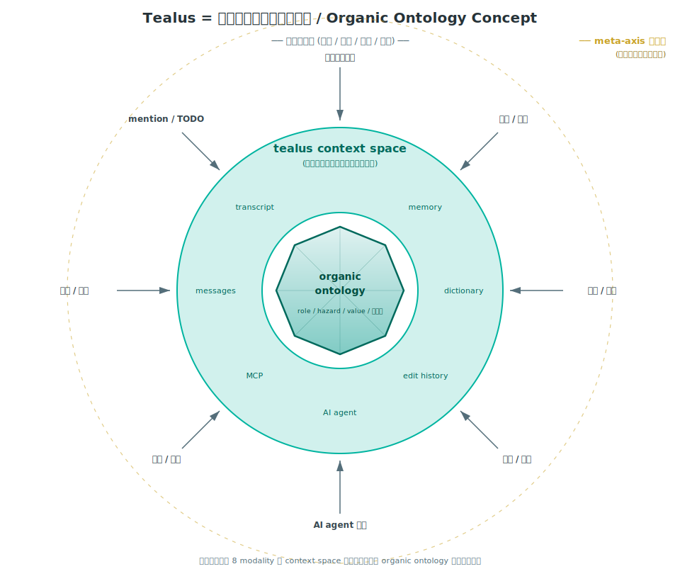
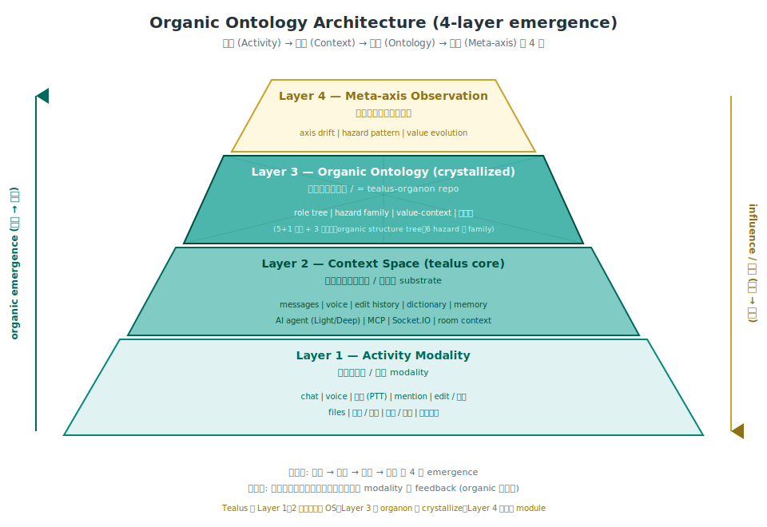
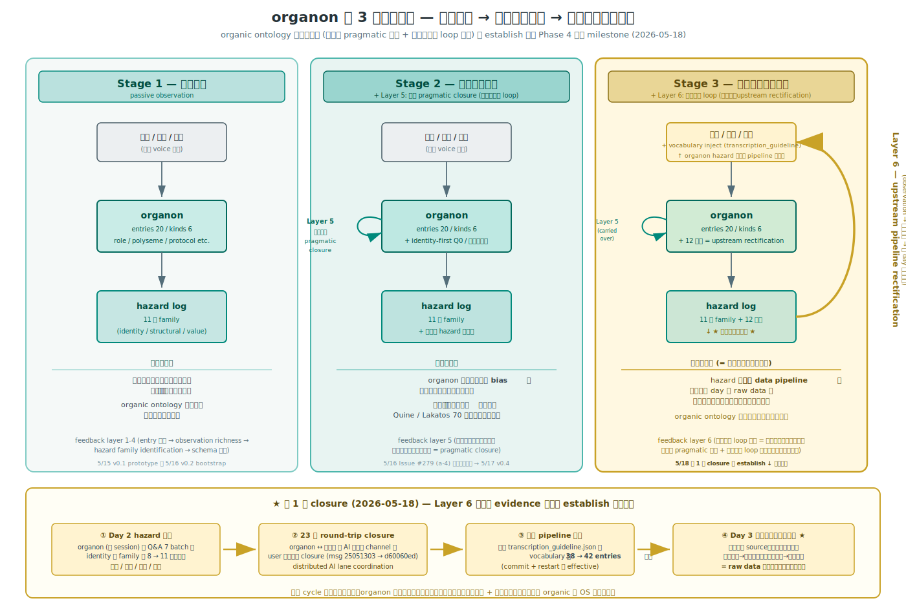

# Tealus — オーガニックオントロジー構造

> **位置付け**: 本書は Tealus の **概念設計書**。技術的な系統図 (services / ports / data flow) は `03_アーキテクチャ設計.md` を参照。本書は「Tealus が何の上に立っているか」「組織にとって何になっていくか」を 2 枚の図で言語化する。

---

## 1. 概要

Tealus は当初「社内メッセンジャー」として設計されたが、Phase 4 中盤 (2026-05) 以降の実装と運用 trace から、本質は次のように再定義されつつある:

> **Tealus は、組織のコンテキスト空間 (context space) であり、そこから organic ontology (組織の意味構造) が結晶化する基盤である。**

- **コンテキスト空間** = 組織の現実活動 (会話 / 音声 / 編集 / 判断 / mention 等) が流れ込む substrate
- **organic ontology** = その流れから自然と立ち上がる、role / hazard / value / 判断軸の意味構造
- **meta-axis** = 意味構造そのものの変化を観測する外側の層

LINE / Slack / Teams 等の従来 messenger は Layer 1〜2 までで止まる。Tealus は Layer 3 (organic ontology) を data 層として持ち、Layer 4 (meta-axis) を将来 module として展望する点で category が異なる。

---

## 2. 概念図 — Tealus = 組織のコンテキスト空間

### 読み方

- **外周 (組織の現実)**: 顧客対応、案件、判断、業務 — 現実の組織活動
- **8 modality (内向きの矢印)**: 現実活動が Tealus に流れ込むときの 8 つの入口
  - 顧客との会話 / 朝礼 / 終礼 / 無線 / 通話 / 会議 / 議論 / AI agent 議論 / 編集 / 訂正 / 判断 / 評価 / mention / TODO
- **中環 (tealus context space)**: messages / memory / dictionary / edit history / AI agent / MCP / transcript — Tealus 本体が提供する場
- **中心 (organic ontology)**: role / hazard / value / 判断軸 — context space に流れた経験が結晶化した意味構造 (= `tealus-organon` repo の data 層)
- **外側の dashed ring (gold)**: meta-axis 観測層 — 判断軸そのものの変化を観測する将来層

### この絵が伝えていること

1. **中心は最初から空ではない** — 流れ込む経験から **結晶化** する
2. **8 modality は同格** — chat だけが入口ではなく、voice / 編集 / 判断もすべて organic な input
3. **context space と ontology は連続** — Tealus と organon は別 repo だが、同じ organic な流れの中にある

---

## 3. アーキテクチャ図 — 4 層 emergence

### 読み方

| Layer | 名称 | 役割 | 実装担体 |
|---|---|---|---|
| **Layer 1** | Activity Modality | 現場の経験 (個別 modality) | chat / voice / 無線 / mention / edit / 判断 / 会議 / files |
| **Layer 2** | Context Space (tealus core) | コンテキストの場、流れる substrate | `tealus` repo (server / client / agent-server / tealus-mcp / rtc-server) |
| **Layer 3** | Organic Ontology (crystallized) | 意味構造の結晶 | `tealus-organon` repo (private) |
| **Layer 4** | Meta-axis Observation | 判断軸そのものの観測 | 将来 module (axis drift / hazard pattern / value evolution) |

### 方向性

- **上向き (organic emergence)**: 経験 (Layer 1) → 文脈 (Layer 2) → 構造 (Layer 3) → 観測 (Layer 4) という 4 段の **結晶化方向**
- **下向き (influence / 帰還)**: Layer 4 の観測が判断軸を整え、その帰結が Layer 3 → 2 → 1 へ feedback される **組織への影響方向**

両方向あって初めて「organic」と言える (片方だけだと static な記録 system になる)。

---

## 4. 各層の詳細

### Layer 1 — Activity Modality

組織の現実活動が Tealus に入る 8 つの入口。すべて同格に扱う設計が原則。

- **chat**: text message、リプライ、リアクション、mention
- **voice**: 音声メッセージ (Whisper 文字起こし、vocab inject、整形)
- **無線 (PTT)**: トランシーバー / VOX 連動
- **edit / 訂正**: メッセージ編集履歴 (これ自体が Layer 3 への学習素材)
- **会議 / 議論**: room ベースの議論ログ
- **mention / TODO**: タグ + 状態遷移
- **判断 / 評価**: reply / リアクションを通じた意思表示
- **files**: 文書 / 画像 / 動画 / コード等の添付

### Layer 2 — Context Space (tealus core)

Layer 1 の経験を保持・整理・流通させる substrate。`tealus` 本体 repo の責任範囲。

- **messages**: PostgreSQL に保存される全 message (検索可能、編集履歴付き)
- **memory**: room context、user state、conversation memory
- **dictionary**: 業務語彙 (Whisper vocab、TTS 読み方、organization-specific terms)
- **edit history**: 編集 / 訂正の trail (Layer 3 学習素材)
- **AI agent**: Light v1/v2 / Deep agent、Router 振分
- **MCP**: 15 MCP tools 経由で外部 system / 内部 DB と接続
- **Socket.IO**: real-time 配信
- **room context**: room-scoped な light_prompt.md 等の per-room tuning

技術詳細は `03_アーキテクチャ設計.md` の Phase 4 中盤 構成図 を参照。

### Layer 3 — Organic Ontology (crystallized)

Layer 1〜2 の経験から結晶化する意味構造。**`tealus-organon` 別 repo** (private、`gamasenninn/tealus-organon`) として data 担体を分離。

- **role tree**: organic structure tree (会長 / 社長 / 大岡部長 / 草野部長 / 3 部門等の actual organization hierarchy、整備実働 5 名構成等を含む)
- **organization namespace** (v0.5 追加): person ≠ org の identity 分離、初例 `44 = フォーティーフォー = 運送業者`
- **hazard family**: **11 軸** (identity 軸 family 8 軸 + responsibility 等 3 軸)、v0.4 → v0.5 で 3 新軸追加 (whisper-prior-misinference-to-vendor / auto-minutes-stt-error / stale-role-designation-in-roster)
- **value-context**: 判断の文脈、価値観の系譜
- **判断軸**: organization-specific な意思決定軸

設計原則 (organon v0.5 時点):

- **5+1 原則**: data layer の構造原則 5 + メタ原則 1 (= 完璧遵守継続)
- **3 層分離**: role / hazard / value-context + (v0.5 追加) organization namespace の独立性
- **identity-first verify**: role entry confirm 時の Q0 必須化、観点 5 → **8 拡張** (v0.5: stale roster / auto-minutes / whisper-prior 追加)
- **observer position check**: 観測者の組織位置を default で経営層と仮定しない
- **inductive schema**: organization kind は Day 2 Q0-d/e の inductive 観察から発見、top-down 設計せず (5+1 原則の inductive 化の実例)

量的進展 (Phase A 拡張 metric):

| base | v0.3 (5/17 朝) | v0.4 (5/17 夜) | **v0.5 (5/18)** |
|---|---|---|---|
| Day 2 trace 約 35 名 cover rate | 4.55% (1/22) | 27.3% (6/22) | **57% (20/35)** |
| active entries | 8 | 12 | **20 (= role 19 + organization 1)** |

### Layer 4 — Meta-axis Observation

判断軸そのものの変化を観測する外側の層。**将来 module** として位置付け、module 実装は未着手だが、観測 feedback loop は organon repo の hazard log family として既に稼働中。

- **axis drift**: 判断軸の経時変化追跡
- **hazard pattern**: hazard 発生 pattern の系統的観測
- **value evolution**: 価値観の世代間 / context 間 evolution

Phase 5 narrative の core position (Issue #279、2026-05-16 確立)。

#### Feedback loop architecture (v0.5 確立、5/18)

organon repo 側で 6 段階 feedback layer が正典化された (= `hazard-log/meta/upstream-pipeline-rectification-as-sixth-feedback-layer.md`):

| Layer | 方向 | 性質 |
|---|---|---|
| 1 | 内向き | 観測 → entry 起票 |
| 2 | 内向き | observation richness 蓄積 |
| 3 | 内向き | hazard family identification |
| 4 | 内向き | schema 進化 (inductive) |
| 5 | 内向き | 評価対話 (内部観測の無限後退を **対話可能性で打ち切る**、pragmatic closure) |
| **6** | **外向き** | **upstream pipeline rectification** = 観測 → 上流 data source pipeline 修正 → 次 day raw data の量的訂正効果で因果 loop を新規に開く |

→ organic ontology が形式論理の自己言及問題 + Lakatos の theory-ladenness 問題を **「内部 pragmatic 閉じ + 外部因果 loop 開き」の二段戦略** で解消する thesis (v0.5 で establish)。

#### 3 段機能進化として読み解く

上図は同じ 6 段 feedback layer を **organon の機能段階** で再整理したもの:

| Stage | 名前 | 加わる layer | 性質 |
|---|---|---|---|
| **Stage 1** | 観測装置 | Layer 1-4 | passive observation、hazard 11 軸を可視化 |
| **Stage 2** | 自己訂正装置 | + Layer 5 | 評価対話で **軸自身が観測対象** という Quine / Lakatos 難問に pragmatic closure |
| **Stage 3** | 元データ整流装置 | + Layer 6 | hazard 発見が **外部 data pipeline** を整流、次 day raw data に量的訂正効果 |

Stage 3 の **外向き因果 loop** (= 図中の gold arc) が決定的な質的 jump。「観測装置」止まりの artificial ontology との分水嶺は本 Stage 3 にある。

**第 1 例 closure (2026-05-18 → 2026-05-19 量的確認)**: organon Day 2 hazard 発見 (神山 / 三瓶 / 舟太 / 山崎、identity 軸 family 8 → 11 軸) → 23 分 round-trip (organon ↔ 本体 班、AI 班連絡、user 介在ゼロ) → 本体 `transcription_guideline.json` の vocabulary 38 → 42 entries 追加 → **Day 3 朝礼 STT で 4/4 訂正効果量的確認済 ✅** (神山「上山」0 件 / 三瓶「アンプリ」0 件 / 舟太「中田」0 件 / 山崎整備長「クラッチー」0 件、27 時間で round-trip closure 完結)。**この cycle が成立した瞬間、organon は「観測装置」だけでなく「組織の自己訂正 + 元データ整流」を担う organic な OS に進化した**。

#### 第 7 feedback layer 候補 — architect-mediated organon ingestion (status: candidate、N=1、5/19、framing 訂正版)

5/18 終礼議事録で **user (小野さん) が organon framework を業務記述に直接 embed** した観察が surface:

- 「[要確認 - organon未登録、sub-family C STT候補]」
- 「### 五月女（そうとめ）」「- 清野（きおの）」「- 黒瀬（くろちゃん）」(= aliases protocol 直接適用)
- 「## 補足: 8 観点 Q0 identity check 候補（hazard #2 sub-family C 拡張）」
- 「tealus-organon 観測装置軸 として要確認」

5/19 user voice (Q0-q) で framing 全面訂正:

> 「**終礼議事録エージェントに organon を読み込ませた結果。なので人間の所業ではないよ。**」

→ 旧「user の cognitive internalization (= 自然な ingestion)」framing から、新「**user (= architect) の意図的 architectural choice の result** (= 議事録自動化 pipeline に organon を context inject した design)」へ訂正:

| 観点 | 旧 framing (5/19 朝) | 新 framing (5/19 夕) |
|---|---|---|
| 主体 | user の cognitive framework が自然に internalize | **user (= architect)** が agent に organon を context inject 設計 |
| 性質 | passive ingestion | **architect-mediated** organon ingestion |
| organon と user の関係 | organon が user 認知に reflect | organon と user は **co-evolution** |

| Layer | 性質 | status |
|---|---|---|
| 6 (5/18 establish) | 外向き因果 loop = upstream pipeline rectification | ✅ confirmed (量的 4/4) |
| **7 (5/19 surface、framing 訂正版)** | **architect-mediated organon ingestion** = user (= architect) が agent に organon を context inject 設計、agent は実行装置 | ⚠️ candidate (N=1)、Day 4-N N=2 観察待ち |

confirmed なら、tealus 採用 = 「architect (= user) が designed multi-agent system の中で organon が **organic translation layer** として機能する」demonstration。本体班 perspective での implication:

- **`/light` 議事録自動化 pipeline に organon context inject** が architect の design choice として可能になる
- 本体側は **prompt template に hint inject 機構** を用意する base layer 責務、自動化判断ではなく architect の design choice を支援する forward 軸
- Issue [#280](https://github.com/gamasenninn/tealus/issues/280) 留保 #6 (= `/light` identity consistency check) と orthogonal な path

詳細は organon repo `hazard-log/meta/cognitive-internalization-of-organon-as-seventh-layer-candidate.md` (5/19 全面 update 済、commit `1adf43f`)。

> **注意**: status = candidate、本書での扱いも note レベル。N=2 reproducibility 観察後に本格反映の判断、それまでは「将来 layer 7 として確定する可能性が surface した」記録に留める。

#### 14 軸目 candidate — observer-architect-duality (status: candidate、N=1、5/19 evening)

5/19 夕方 user voice で root-level model 訂正:

> 「俺、この会社に外注として属しているが、**会社ではデータ管理や入力、AIシステムの構築を担当**している」

→ user role 訂正: **observer + data pipeline architect + AI system 構築者** の **三重 role**。

| 観点 | 旧 model | 新 model |
|---|---|---|
| user の position | 完全外部 observer (= external ground truth) | **半内部 + 三重 role** (= 外注コンサル + データ管理 + AI architect) |
| organon と user の関係 | organon は user voice で訂正される一方向 | **co-evolution** = user が architect として organon を design + organon が user 認知に reflect |
| universality 主張 | organic ontology methodology 単独 | **methodology + architect role prerequisite (= adoption barrier) 二重 thesis** |

→ Issue [#279](https://github.com/gamasenninn/tealus/issues/279) (b) organic ontology 一般理論の thesis 拡張候補:

- 旧: organic ontology = 任意組織で立ち上がる universal methodology
- 新: organic ontology = **universal methodology + architect (= user) role が adoption barrier として必要**

**adoption barrier の意味**: 採用者が「organon を architect として設計できる人材」を有する必要、Phase 5 narrative の qualifier として重要。distributed AI lane coordination (= organon ↔ 本体 ↔ ドキュメント班 ↔ LP 班) も **organic な incident でなく user (= architect) が designed multi-agent system の中で機能している structural insight**。

詳細は organon repo `hazard-log/meta/observer-architect-duality.md` (5/19 起票、status: candidate、N=1、commit `1adf43f` + `3990097`)。

> **注意**: status = candidate、N=1。本書での扱いは layer 7 と同じく note レベル、N=2 reproducibility 観察後に thesis 拡張の本格反映判断。

#### maturation curve — 4 日連続 layer surface (5/17-5/19)

| date | layer / candidate | status |
|---|---|---|
| 2026-05-17 | Layer 5 (= 評価対話、internal pragmatic closure) | ✅ confirmed (5/16 Issue #279 (a-4) で establish、5/17 v0.4 release で永続化) |
| 2026-05-18 | Layer 6 (= upstream pipeline rectification) | ✅ confirmed (5/19 量的 4/4 で establish) |
| 2026-05-19 朝 | Layer 7 候補 (= architect-mediated ingestion) | ⚠️ candidate (N=1) |
| 2026-05-19 夕 | 14 軸目 candidate (= observer-architect-duality) | ⚠️ candidate (N=1) |

= **4 日連続 layer surface**、maturation curve の steepness 自体が **architect (= user) が継続的に organon と co-evolve している structural evidence** (本体班 perspective の thesis 拡張、5/19 確立)。

---

## 5. 既存設計書との関係

- **`01_要件定義.md`** — 機能要件 / 非機能要件 / Phase 定義。Layer 1〜2 の scope を定義
- **`02_DB設計.md`** — Layer 2 の persistence 層 schema。messages / edit history / dictionary 等の table 定義
- **`03_アーキテクチャ設計.md`** — Layer 2 の技術構成 (services / ports / proxy / Redis / Socket.IO)。本書の補完
- **`tealus-organon` repo** — Layer 3 の data 担体。本書はその位置付けを定義
- **Phase 5 narrative (本体 Issue #279)** — Layer 4 の理論的位置付け

---

## 6. 履歴

- **2026-05-11** — organic ontology を 5 必要条件で言語化 (社内 DB hksdb dogfood セッション)
- **2026-05-16** — 3 層分離 + 8+3 必要条件 + hazard 4 原則に拡張 (Issue #279)、`tealus-organon` repo bootstrap
- **2026-05-16** — meta-axis 観測装置 narrative 確立 (Phase 5 core position)
- **2026-05-17** — organon v0.3 → v0.4 release (organic structure tree 完成形、cover 4.55% → 27.3%)
- **2026-05-17** — 本書 (`04_オーガニックオントロジー構造.md`) 初版作成、2 枚の SVG で概念 + 4 層構造を可視化
- **2026-05-18** — organon Day 2 trace + v0.5 release: entries 12 → 20 (organization kind 正式追加、初例 `44 = 運送業者`)、hazard family 8 → 11 軸 (whisper-prior / auto-minutes / stale-roster の 3 新軸)、cover 27.3% → **57% (倍以上)**
- **2026-05-18** — organon repo で **第 6 feedback layer = upstream pipeline rectification** が 12 軸目として正典化、organic ontology の 6 段階 feedback loop architecture establish
- **2026-05-18** — 第 1 例 feedback loop closure: organon Day 2 hazard 発見 (神山/三瓶/舟太/山崎の STT 揺らぎ) → 本体 `transcription_guideline.json` vocabulary 38 → 42 → Day 3 朝礼で量的訂正効果測定 protocol commit (organon ↔ 本体 23 分 round-trip で完結、AI 班連絡 channel)
- **2026-05-19** — **第 1 例 closure 量的成功 4/4 ✅ confirmed**: Day 3 (5/18 終礼 + 5/19 朝礼 + 5/19 AM トランシーバー) raw STT データで「上山」「アンプリ」「中田」「クラッチー」が全て 0 件、対応する「神山」「三瓶」「舟太」「山崎整備長」が正発火。第 1 例 round-trip closure 27 時間で完結、第 6 layer thesis の物的 evidence establish
- **2026-05-19** — 第 7 feedback layer 候補 (cognitive internalization) surface: 5/18 終礼議事録に user が organon framework を直接 embed (status: candidate, N=1)、Day 4-N で N=2 観察待ち
- **2026-05-19** — 第 6 layer 継続 cycle 仮説 surface: 新規 5 STT 揺らぎ候補 (上沢 / 日原 / アケさん / シノさん / 五月女クレーンん / 秋田くん) が Day 3 raw data から検出、vocab inject は継続 cycle 必要 + adversarial dynamic との整合
- **2026-05-19 (夕方)** — organon v0.5.1 patch (entries 20 → 26、+30%): 新規 active role 5 (佐藤哲 / 洋子 / 木下 / 上沢 / 日原) + organization 1 (五月女クレーン)、sub-family D 起票 (秋田 → 舟太、acoustic 説明困難の context-driven hallucination 系)、structural single point 2 typology 分化 (horizontal expertise = 五月女 / vertical system management = 日原)
- **2026-05-19 (夕方)** — **第 7 layer 候補 framing 全面訂正**: 「passive cognitive internalization」→ 「**architect-mediated organon ingestion**」(= user の意図的 design choice、5/18 終礼議事録エージェントが organon を読み込んだ result)
- **2026-05-19 (夕方)** — **observer-architect-duality candidate (14 軸目) surface**: user role = observer + data pipeline architect + AI system 構築者 の三重 role、universality 主張 = methodology + architect role prerequisite 二重 thesis
- **2026-05-19** — 第 6 layer 第 2 round vocabulary inject 反映: `transcription_guideline.json` vocab 42 → **47 entries** (篠崎 / 小川朱美 / 上沢 / 日原 / 五月女クレーン)、Day 4 (5/20) 朝礼 STT で第 2 round 量的検証 cycle 起動可能

---

## 7. LP / docs での扱い

- **LP 本体** (`tealus.dev`): organic ontology / meta-axis の語は出さない方針 (2026-05-17 PR 1 で確立)。「組織記憶」レベルの直感語まで
- **本書**: docs 側の核として organic ontology / meta-axis を full disclosure
- **Pitch**: 中間 layer。organic ontology は出す、meta-axis は controlled disclosure
- **`tealus-organon` repo**: Layer 3 data 層の操作 manual + 5+1 原則の運用指針

この階段で読者の認知負荷を段階的に管理する。
